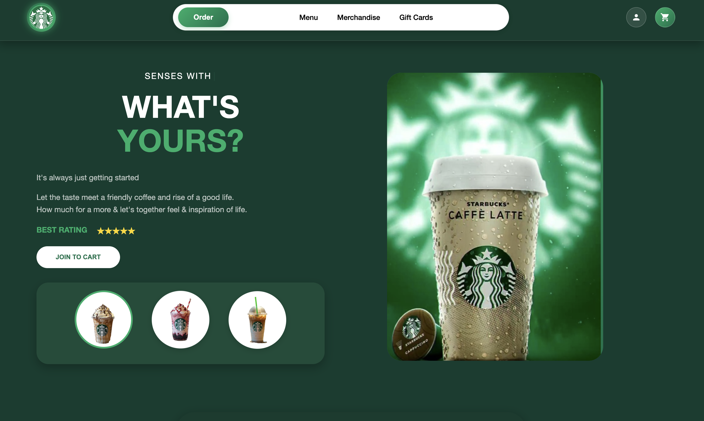
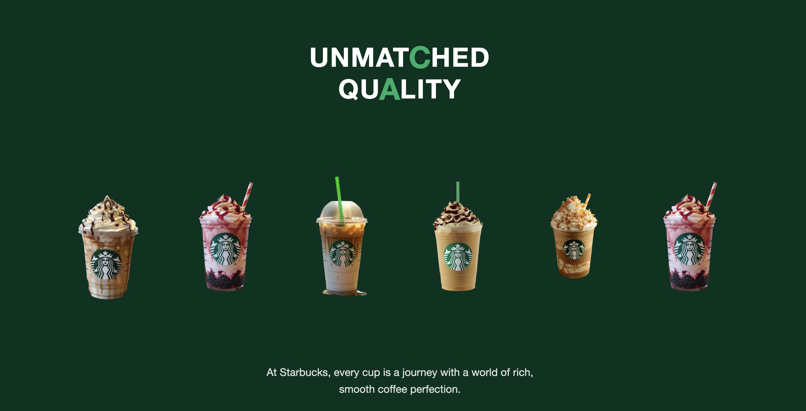
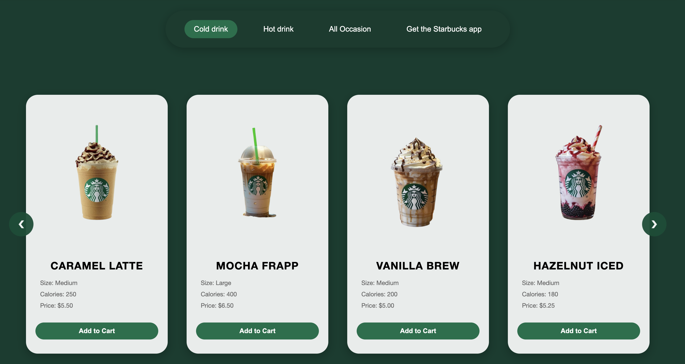

# Starbucks Frontend Clone

A modern, fully responsive Starbucks landing page clone built using HTML, CSS, and JavaScript.  
This project recreates the elegant and minimal Starbucks website experience, featuring smooth animations, interactive cards, and a visually appealing design.

---

## Features

- Modern, Starbucks-inspired UI design  
- Responsive navigation bar  
- Hero section with animated text and transitions  
- Offerings section with hover and animation effects  
- Smooth scrolling and clean layout  
- Fully responsive across all devices  

---

## Tech Stack

- HTML5  
- CSS3 (Flexbox + Grid)  
- JavaScript (Vanilla)

---

## Project Preview

You can add screenshots of your website below to visually showcase the sections of your Starbucks clone.

### Homepage  



### Our Offerings Section  



### Unmatched Quality Section  

 



---

## Setup Instructions

1. Clone this repository:
   ```bash
   git clone https://github.com/yourusername/starbucks-frontend-clone.git
